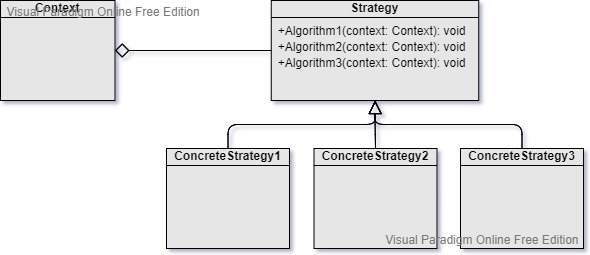

Strategy
===
Scenario: When some calculation logics and algorithms need to be switched dynamically.

Pattern: A context object contains a strategy object that can be replaced at runtime.

Example: Attribute calculation logic can be switched for different types of character.

